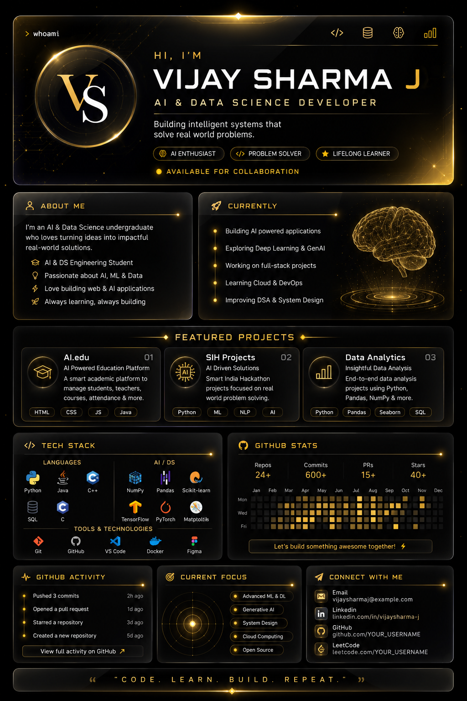

<div align="center">



<br><br>


<br><br>

<b>AI & DATA SCIENCE</b>
&nbsp; • &nbsp;
<b>DEVELOPER</b>
&nbsp; • &nbsp;
<b>PROBLEM SOLVER</b>

</div>

---

## ◇ ABOUT ME

I'm an **AI & Data Science student and developer** interested in turning ideas into practical software.

- 🧠 Artificial Intelligence & Machine Learning
- 📊 Data Science & Data Analysis
- 💻 Software & Web Development
- 🚀 Hackathons & Prototyping
- 🌱 Learning by building

---

## ✦ CURRENTLY

```text
[01] Exploring AI / ML
[02] Building web applications
[03] Working on hackathon projects
[04] Improving DSA & Java
[05] Learning by building
